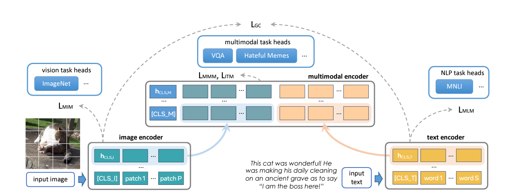
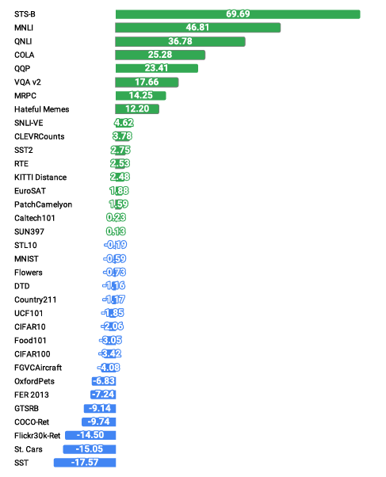

> **Objective** :
> - Understanding the key elements of FLAVA
> - Highlighting its limitations
> - Extracting valuable insights for the future of multimodal AI

  
   
  <em><small>Figure 1: FLAVA Architecture</small></em>

## 1. Three Key Innovations of FLAVA

### 1.1 Unified Multimodal Pretraining

FLAVA sets out to create a "universal" model that can effectively handle vision tasks, language tasks, and multimodal reasoning. This contrasts with many existing models like CLIP and ALIGN that perform well in specific domains but struggle when required to handle tasks that require deep integration between vision and language.

**Why This Matters:**  
The ability to fuse vision and language seamlessly could lead to breakthroughs in real-world applications such as autonomous systems, healthcare, and robotics, where multimodal understanding is key to solving complex tasks. FLAVA’s ability to pretrain on both unimodal and multimodal data represents a huge leap towards developing a generalizable AI.

### 1.2 Multimodal Pretraining Objectives

FLAVA introduces a variety of innovative training objectives:
- **Global Contrastive Loss**: Inspired by CLIP, this loss ensures that the model learns meaningful relationships between images and texts.
- **Masked Multimodal Modeling (MMM)**: This pretraining strategy is a novel extension of masked language models like BERT, but it is applied to both images and texts, significantly improving multimodal task performance.
- **Image-Text Matching (ITM)**: This objective helps the model discern whether an image and text are correctly paired, further reinforcing multimodal learning.

**Why This Matters:**  
These pretraining objectives are designed to make the model adaptable across vision-only, language-only, and vision-and-language tasks. For example, in visual question answering (VQA), the combination of these objectives makes FLAVA highly effective in learning how visual and textual information interrelates.

### 1.3 Open Dataset Approach

One of FLAVA’s most attractive features is its reliance on publicly available datasets, totaling 70M image-text pairs. Compared to models like ALIGN (which used 1.8B pairs from private datasets), FLAVA democratizes access to research resources by training on publicly accessible data. This enables more researchers to reproduce and build on this work, fostering a more open scientific community.

**Why This Matters:**  
The transparency of FLAVA’s dataset usage not only accelerates reproducibility but also ensures a broader, more ethical application of AI technologies, as researchers can avoid the opaque, closed datasets used by models like ALIGN and CLIP.

  
   
  <em><small>Figure 2: Performance Difference Between FLAVA and CLIP-ViT-B/16 on Vision, Language, and Multimodal Tasks</small></em>

## 2. One Glaring Deficiency: Handling Massive Data

### 2.1 Struggling with Large-Scale Tasks

Despite its impressive performance across various modalities, FLAVA struggles when scaling to datasets with orders of magnitude more data, such as those handled by CLIP or ALIGN. FLAVA’s training on "only" 70M image-text pairs, while groundbreaking in its transparency, puts it at a disadvantage when compared to models that utilize massive private datasets.

**The Deficiency:**  
FLAVA’s general performance still lags slightly behind other state-of-the-art models when scaling vision-specific or large-scale multimodal tasks, particularly in domains where the volume of training data is critical.

**Why This Matters:**  
This limitation could make FLAVA less appealing in commercial applications where large-scale data dominates, such as autonomous vehicle systems or large content moderation systems in social media platforms.

### 2.2 Optimization Challenges

Moreover, the paper highlights how adding different tasks—vision, language, and multimodal reasoning—together creates optimization complexity. The model performs slightly better on individual vision or language tasks, but struggles to maintain that performance across the board when attempting to merge the training on all modalities.

**The Deficiency:**  
This indicates that while FLAVA has made strides in multimodal integration, it still faces hurdles when it comes to optimizing and balancing tasks across domains simultaneously. Improving the model’s ability to handle this balance would make it more versatile and robust.

---

## 3. Conclusion: FLAVA's Role in the Future of Multimodal AI

FLAVA marks an impressive step toward a universal model capable of handling vision, language, and their fusion. Its innovative pretraining objectives, such as MMM and global contrastive loss, enable it to excel in multimodal tasks, despite using a much smaller dataset than competitors like ALIGN and CLIP.

**My Insight:**  
The key challenge for FLAVA, and indeed for any foundational model, will be scaling while maintaining high performance across all domains. While FLAVA's reliance on public datasets is a powerful move toward open science, expanding its training to include much larger datasets will likely be necessary to fully compete with closed-source models. Nonetheless, FLAVA’s transparency and accessibility make it a promising platform for researchers aiming to push the boundaries of multimodal AI.

---

## References

- FLAVA Paper: [FLAVA: A Foundational Language and Vision Alignment Model](https://flava-model.github.io/)
- CLIP Paper: [CLIP: Contrastive Language–Image Pretraining](https://openai.com/research/clip)
- ALIGN Paper: [Scaling up Visual and Vision-Language Representation Learning](https://arxiv.org/pdf/2104.06283.pdf)

---

